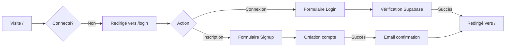
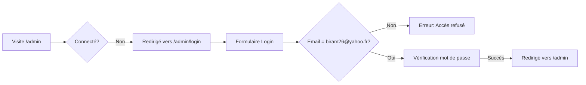

# 🔐 Système d'Authentification - Documentation

**Date de mise à jour** : 28 janvier 2026  
**Version** : 2.0.0

---

## 📋 Vue d'ensemble

Le système d'authentification de **Tuteur Maths App** est maintenant divisé en **deux parcours distincts** :

### 1️⃣ **Espace Élève** (`/login`)
- ✅ **Connexion** avec email et mot de passe
- ✅ **Inscription** pour créer un nouveau compte
- ✅ Accès à l'interface élève (`/`)
- ✅ Design cyan/fuchsia

### 2️⃣ **Espace Professeur** (`/admin/login`)
- ✅ **Connexion uniquement** (pas d'inscription)
- ✅ Réservé à `biram26@yahoo.fr`
- ✅ Accès au dashboard admin (`/admin`)
- ✅ Design orange/rouge

---

## 🎯 Parcours Utilisateur

### Parcours Élève



### Parcours Professeur



---

## 🔒 Règles de Sécurité

### Middleware (`lib/middleware.ts`)

Le middleware applique les règles suivantes :

1. **Routes publiques** : Aucune (toutes les routes nécessitent une authentification)
   
2. **Routes de login** :
   - `/login` - Accessible sans authentification (élèves)
   - `/admin/login` - Accessible sans authentification (professeur)
   - `/auth/*` - Callbacks Supabase

3. **Redirection si non connecté** :
   - Toute tentative d'accès → `/login`
   - Sauf `/admin/*` → `/admin/login`

4. **Redirection si déjà connecté** :
   - Élève sur `/login` → `/`
   - Professeur sur `/login` ou `/admin/login` → `/admin`

5. **Protection admin** :
   - Route `/admin/*` accessible uniquement si `user.email === 'biram26@yahoo.fr'`
   - Sinon → `/admin/login`

---

## 📁 Structure des Fichiers

```
app/
├── login/                          # Espace Élève
│   ├── page.tsx                    # Page serveur
│   └── LoginPageClient.tsx         # Composant client (connexion + inscription)
│
├── admin/
│   └── login/                      # Espace Professeur
│       ├── page.tsx                # Page serveur
│       └── AdminLoginClient.tsx    # Composant client (connexion uniquement)
│
└── auth/
    └── actions.ts                  # Actions serveur
        ├── login()                 # Connexion élève
        ├── signup()                # Inscription élève
        ├── adminLogin()            # Connexion professeur
        └── logout()                # Déconnexion

lib/
└── middleware.ts                   # Logique de protection des routes
```

---

## 🎨 Différences Visuelles

| Élément | Espace Élève | Espace Professeur |
|---------|--------------|-------------------|
| **Icône** | 📐 | 👨‍🏫 |
| **Couleurs** | Cyan/Fuchsia | Orange/Rouge |
| **Titre** | "Tuteur Maths" | "Espace Professeur" |
| **Sous-titre** | "Quantum Gateway v2.0" | "Admin Portal v2.0" |
| **Onglets** | Connexion + Inscription | Connexion uniquement |
| **Badge** | - | "Accès Réservé au Professeur" |

---

## 🔧 Actions Serveur

### `login(formData)` - Connexion Élève

```typescript
// Fichier: app/auth/actions.ts
export async function login(formData: FormData) {
    const supabase = await createClient()
    
    const data = {
        email: formData.get('email') as string,
        password: formData.get('password') as string,
    }
    
    const { error } = await supabase.auth.signInWithPassword(data)
    
    if (error) {
        redirect('/login?error=...')
    }
    
    redirect('/')
}
```

### `signup(formData)` - Inscription Élève

```typescript
export async function signup(formData: FormData) {
    const supabase = await createClient()
    
    const data = {
        email: formData.get('email') as string,
        password: formData.get('password') as string,
    }
    
    const { error } = await supabase.auth.signUp(data)
    
    if (error) {
        redirect('/login?error=...')
    }
    
    redirect('/login?message=Compte créé ! Vérifiez votre email.')
}
```

### `adminLogin(formData)` - Connexion Professeur

```typescript
export async function adminLogin(formData: FormData) {
    const supabase = await createClient()
    
    const email = formData.get('email') as string
    const password = formData.get('password') as string
    
    // ⚠️ Vérification stricte de l'email
    if (email !== 'biram26@yahoo.fr') {
        redirect('/admin/login?error=Accès refusé...')
    }
    
    const { error } = await supabase.auth.signInWithPassword({ email, password })
    
    if (error) {
        redirect('/admin/login?error=...')
    }
    
    redirect('/admin')
}
```

### `logout()` - Déconnexion

```typescript
export async function logout() {
    const supabase = await createClient()
    await supabase.auth.signOut()
    
    redirect('/login')
}
```

---

## 🧪 Tests à Effectuer

### Test 1 : Inscription Élève
1. Aller sur `/login`
2. Cliquer sur "Inscription"
3. Entrer un email et mot de passe
4. Cliquer sur "Créer Nouvel Accès"
5. ✅ Vérifier : Message de confirmation + email reçu

### Test 2 : Connexion Élève
1. Aller sur `/login`
2. Entrer email et mot de passe
3. Cliquer sur "Initialiser Connexion"
4. ✅ Vérifier : Redirection vers `/` (interface élève)

### Test 3 : Connexion Professeur (Succès)
1. Aller sur `/admin/login`
2. Entrer `biram26@yahoo.fr` et le mot de passe
3. Cliquer sur "🔐 Accès Admin"
4. ✅ Vérifier : Redirection vers `/admin` (dashboard)

### Test 4 : Connexion Professeur (Échec)
1. Aller sur `/admin/login`
2. Entrer un autre email (pas `biram26@yahoo.fr`)
3. Cliquer sur "🔐 Accès Admin"
4. ✅ Vérifier : Message "Accès refusé. Seul le professeur peut se connecter ici."

### Test 5 : Protection Routes Admin
1. Se connecter en tant qu'élève
2. Essayer d'accéder à `/admin`
3. ✅ Vérifier : Redirection vers `/admin/login`

### Test 6 : Redirection Automatique
1. Se connecter en tant que professeur
2. Essayer d'accéder à `/login`
3. ✅ Vérifier : Redirection automatique vers `/admin`

---

## 🚀 URLs Importantes

| URL | Description | Accès |
|-----|-------------|-------|
| `/` | Interface élève | Élèves connectés |
| `/login` | Connexion/Inscription élève | Public |
| `/admin` | Dashboard professeur | Professeur uniquement |
| `/admin/login` | Connexion professeur | Public |
| `/auth/callback` | Callback Supabase | Système |

---

## 🔐 Configuration Supabase

### Email du Professeur

L'email du professeur est défini dans :

1. **Variable d'environnement** (`.env.local`) :
   ```bash
   ADMIN_EMAIL=biram26@yahoo.fr
   ```

2. **Code en dur** (pour sécurité maximale) :
   - `app/auth/actions.ts` ligne 51
   - `lib/middleware.ts` lignes 56, 59

### Création du Compte Professeur

Le compte `biram26@yahoo.fr` doit exister dans Supabase Auth :

```bash
# Option 1 : Via Supabase Dashboard
# 1. Aller sur https://supabase.com/dashboard
# 2. Authentication > Users > Add User
# 3. Email: biram26@yahoo.fr
# 4. Password: [votre mot de passe]

# Option 2 : Via l'interface d'inscription élève
# 1. Aller sur /login
# 2. S'inscrire avec biram26@yahoo.fr
# 3. Confirmer l'email
```

---

## 🎯 Flux Complet

### Élève Non Connecté

```
1. Visite https://tuteur-maths.app
   ↓
2. Middleware détecte : pas de session
   ↓
3. Redirection → /login
   ↓
4. Choix : Connexion ou Inscription
   ↓
5. Après succès → Redirection vers /
   ↓
6. Accès à l'interface élève
```

### Professeur Non Connecté

```
1. Visite https://tuteur-maths.app/admin
   ↓
2. Middleware détecte : pas de session
   ↓
3. Redirection → /admin/login
   ↓
4. Connexion avec biram26@yahoo.fr
   ↓
5. Vérification email dans adminLogin()
   ↓
6. Après succès → Redirection vers /admin
   ↓
7. Accès au dashboard admin
```

---

## ⚠️ Points d'Attention

### 1. Confirmation Email (Élèves)

Par défaut, Supabase envoie un email de confirmation lors de l'inscription.

**Options** :
- **Activer** : Sécurité maximale (recommandé en production)
- **Désactiver** : Pour le développement

Configuration dans Supabase Dashboard :
```
Authentication > Settings > Email Auth
→ Enable email confirmations
```

### 2. Mot de Passe Oublié

**Élèves** : Fonctionnalité à implémenter
**Professeur** : Réinitialiser via Supabase Dashboard

### 3. Sécurité

- ✅ Email professeur vérifié côté serveur
- ✅ Middleware protège toutes les routes
- ✅ Pas d'inscription possible pour l'admin
- ✅ Redirection automatique selon le rôle

---

## 📝 Prochaines Améliorations

### Court terme
- [ ] Ajouter "Mot de passe oublié" pour les élèves
- [ ] Afficher le nom de l'utilisateur connecté
- [ ] Ajouter un bouton de déconnexion visible

### Moyen terme
- [ ] Système de rôles dans la base de données
- [ ] Permettre plusieurs professeurs
- [ ] Historique des connexions

### Long terme
- [ ] Authentification à deux facteurs (2FA)
- [ ] Connexion via Google/Microsoft
- [ ] Gestion des sessions multiples

---

## 🆘 Dépannage

### Problème : "Accès refusé" pour le professeur

**Cause** : L'email n'est pas exactement `biram26@yahoo.fr`

**Solution** :
1. Vérifier l'orthographe (minuscules)
2. Vérifier qu'il n'y a pas d'espaces
3. Vérifier que le compte existe dans Supabase

### Problème : Redirection infinie

**Cause** : Middleware mal configuré

**Solution** :
1. Vérifier `lib/middleware.ts`
2. Vérifier les routes dans `middleware.ts` (racine)
3. Nettoyer les cookies du navigateur

### Problème : Email de confirmation non reçu

**Cause** : Configuration Supabase

**Solution** :
1. Vérifier les paramètres SMTP dans Supabase
2. Vérifier les spams
3. Désactiver temporairement la confirmation email

---

**Système d'authentification opérationnel ! 🎉**

*Dernière mise à jour : 28 janvier 2026*
