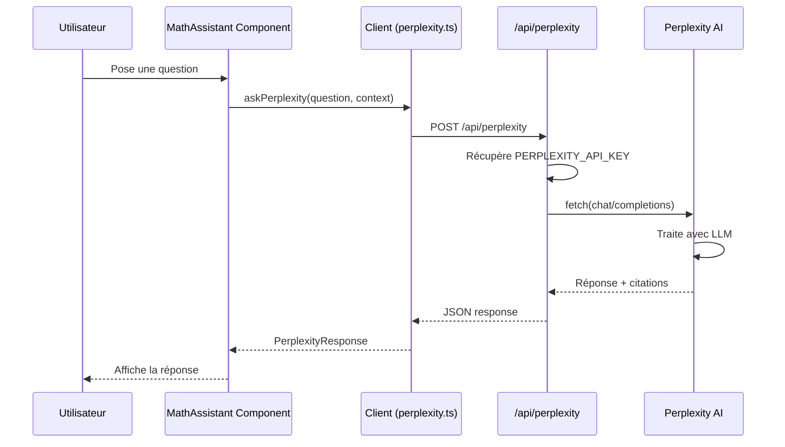
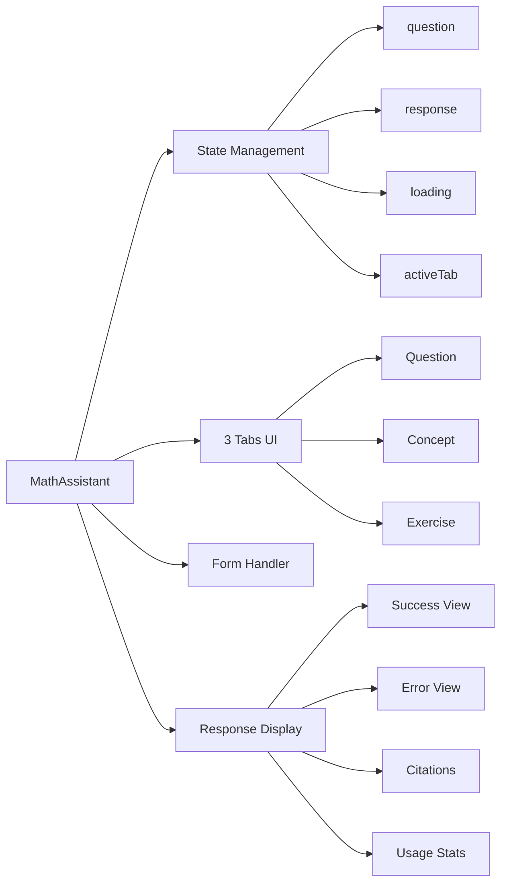
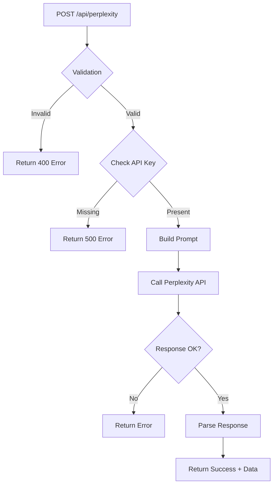
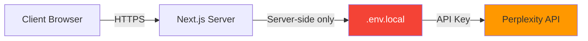
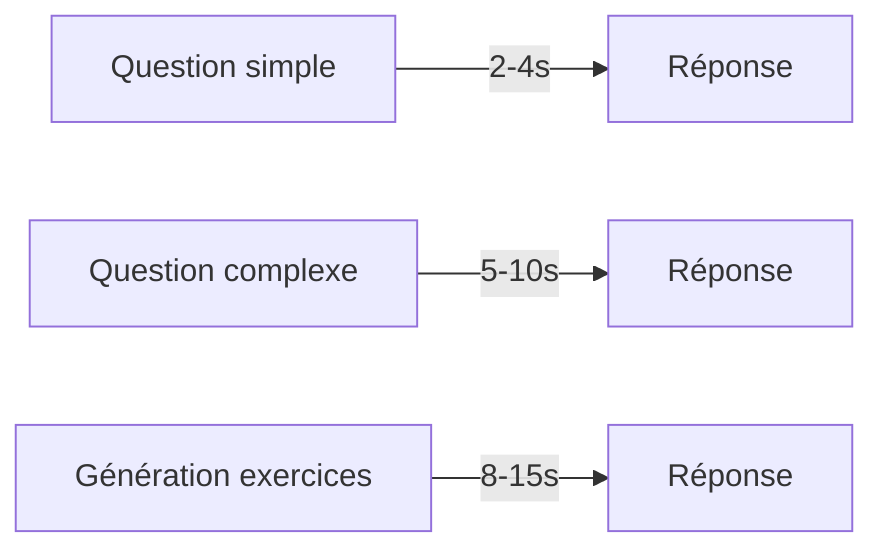
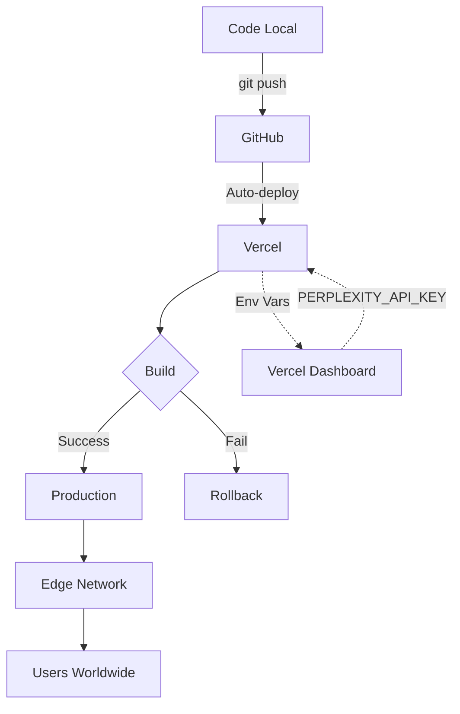
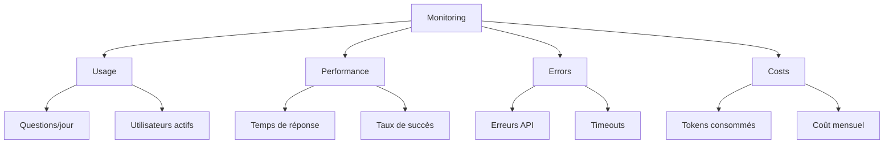
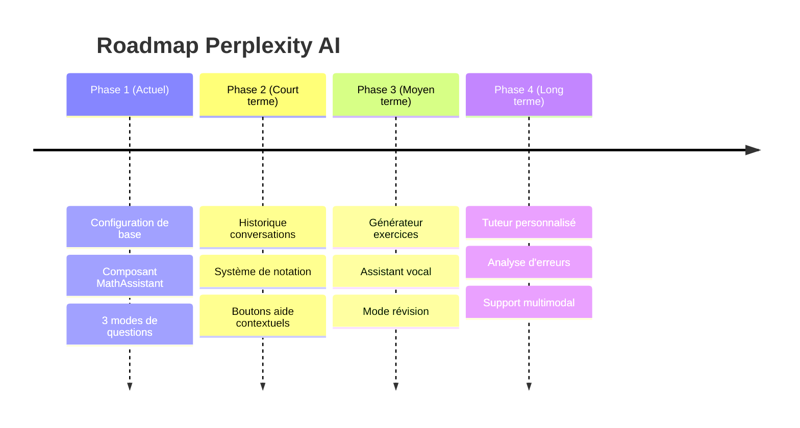

# 🏗️ Architecture de l'intégration Perplexity AI

## Vue d'ensemble du système

```mermaid
graph TB
    subgraph "Frontend - Interface Utilisateur"
        A[Page /assistant] --> B[Composant MathAssistant]
        B --> C{3 Modes}
        C --> D[Question générale]
        C --> E[Expliquer concept]
        C --> F[Aide exercice]
    end
    
    subgraph "Client Layer"
        G[lib/perplexity.ts]
        G --> H[askPerplexity]
        G --> I[explainConcept]
        G --> J[getExerciseHelp]
        G --> K[generateExercises]
    end
    
    subgraph "API Routes - Backend"
        L[/api/perplexity]
        M[/api/test-perplexity]
    end
    
    subgraph "Services Externes"
        N[Perplexity AI API]
        O[llama-3.1-sonar-large-128k-online]
    end
    
    subgraph "Configuration"
        P[.env.local]
        Q[PERPLEXITY_API_KEY]
    end
    
    B --> G
    G --> L
    L --> P
    L --> N
    N --> O
    M --> P
    M --> N
    
    style A fill:#e1f5ff
    style B fill:#b3e5fc
    style L fill:#81c784
    style M fill:#81c784
    style N fill:#ff9800
    style P fill:#f44336,color:#fff
```

## Flux de données



## Structure des fichiers

```
tuteur-maths-app/
│
├── 📁 app/
│   ├── 📁 api/
│   │   ├── 📁 perplexity/
│   │   │   └── 📄 route.ts ..................... Route API principale
│   │   └── 📁 test-perplexity/
│   │       └── 📄 route.ts ..................... Tests automatiques
│   │
│   ├── 📁 components/
│   │   └── 📄 MathAssistant.tsx ................ Composant UI principal
│   │
│   ├── 📁 assistant/
│   │   └── 📄 page.tsx ......................... Page de démonstration
│   │
│   └── 📁 admin/
│       ├── 📄 page.tsx
│       └── 📄 actions.ts ....................... Corrigé pour TypeScript
│
├── 📁 lib/
│   ├── 📄 perplexity.ts ........................ Client TypeScript
│   └── 📄 test-perplexity.ts ................... Scripts de test
│
├── 📁 Documentation/
│   ├── 📄 PERPLEXITY_GUIDE.md .................. Guide complet (250+ lignes)
│   ├── 📄 NEXT_STEPS.md ........................ Prochaines étapes (300+ lignes)
│   ├── 📄 INTEGRATION_COMPLETE.md .............. Récapitulatif
│   └── 📄 README.md ............................ Mis à jour
│
└── 📁 Configuration/
    ├── 📄 .env.local ........................... Variables d'environnement
    └── 📄 .env.example ......................... Template
```

## Composants clés

### 1. MathAssistant Component



### 2. API Route Flow



### 3. Client Functions

```mermaid
graph TB
    A[lib/perplexity.ts] --> B[askPerplexity]
    A --> C[explainConcept]
    A --> D[getExerciseHelp]
    A --> E[generateExercises]
    
    B --> F[Generic Question]
    C --> G[Concept Explanation]
    D --> H[Exercise Help]
    E --> I[Exercise Generation]
    
    F --> J[/api/perplexity]
    G --> J
    H --> J
    I --> J
```

## Modèles de données

### PerplexityResponse Interface

```typescript
interface PerplexityResponse {
  success: boolean;
  response: string;
  citations?: string[];
  usage?: {
    prompt_tokens: number;
    completion_tokens: number;
    total_tokens: number;
  };
  error?: string;
}
```

### API Request Format

```json
{
  "message": "Comment résoudre x² = 9 ?",
  "context": "Niveau Seconde"
}
```

### API Response Format

```json
{
  "success": true,
  "response": "Pour résoudre x² = 9...",
  "citations": ["source1.com", "source2.com"],
  "usage": {
    "prompt_tokens": 50,
    "completion_tokens": 200,
    "total_tokens": 250
  }
}
```

## Configuration

### Variables d'environnement

```bash
# Supabase (existant)
NEXT_PUBLIC_SUPABASE_URL=https://...
NEXT_PUBLIC_SUPABASE_ANON_KEY=eyJ...
SUPABASE_SERVICE_ROLE_KEY=eyJ...
NEXT_PUBLIC_SUPABASE_STORAGE_BUCKET=ressources-cours

# Perplexity AI (nouveau)
PERPLEXITY_API_KEY=pplx-...
```

### Modèle Perplexity utilisé

- **Nom** : `llama-3.1-sonar-large-128k-online`
- **Contexte** : 128k tokens
- **Capacités** : Recherche en ligne, citations
- **Langue** : Multilingue (français forcé via prompt)

## Sécurité



**Points de sécurité** :
- ✅ Clé API jamais exposée au client
- ✅ Variables d'environnement
- ✅ Validation des entrées
- ✅ Gestion des erreurs
- ⚠️ À ajouter : Rate limiting, authentification

## Performance

### Temps de réponse typiques



### Optimisations possibles

1. **Cache** : Stocker les réponses fréquentes
2. **Streaming** : Afficher la réponse en temps réel
3. **Prefetch** : Anticiper les questions courantes
4. **CDN** : Mettre en cache les assets statiques

## Déploiement



## Monitoring

### Métriques à surveiller



## Évolution future



---

**Légende** :
- 🟦 Frontend / UI
- 🟩 Backend / API
- 🟧 Services externes
- 🟥 Configuration sensible

---

*Diagrammes générés avec Mermaid*  
*Dernière mise à jour : 2026-01-17*
